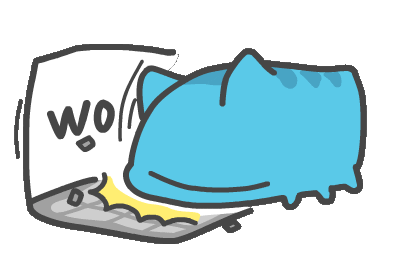

### Hi there 👋

  

  
  

 
<table border="none">
 <tr>
    <td width="50%" align="center">
      
      
   </td>
    <td align="center"> 
      
   </td>
 </tr>
</table>
<!--
**canleit5509/canleit5509** is a ✨ _special_ ✨ repository because its `README.md` (this file) appears on your GitHub profile.

Here are some ideas to get you started:

- 🔭 I’m currently working on ...
- 🌱 I’m currently learning ...
- 👯 I’m looking to collaborate on ...
- 🤔 I’m looking for help with ...
- 💬 Ask me about ...
- 📫 How to reach me: ...
- 😄 Pronouns: ...
- ⚡ Fun fact: ...
-->
